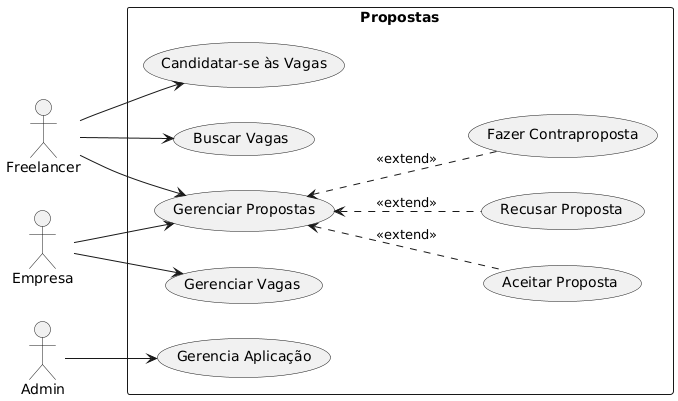
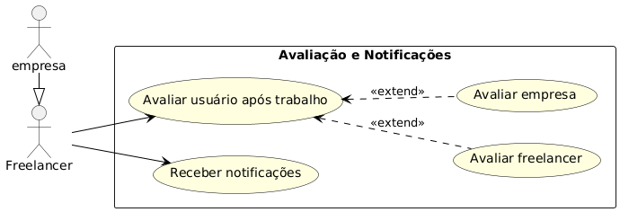
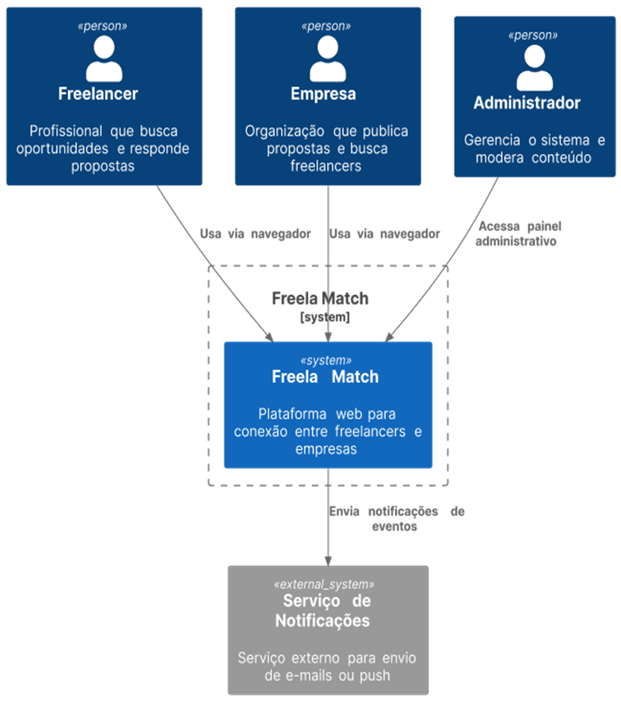
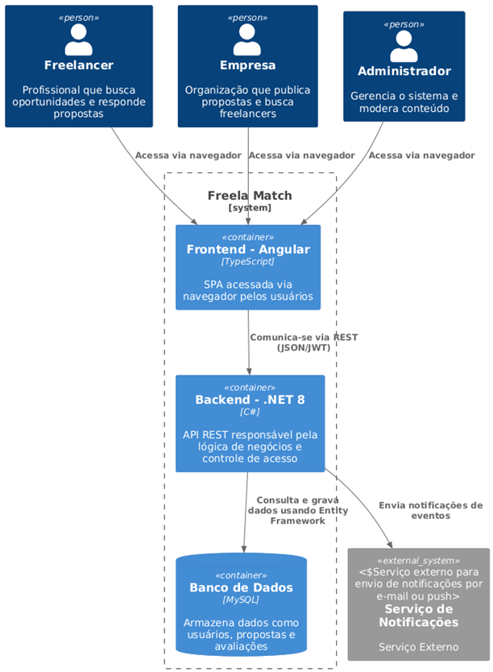
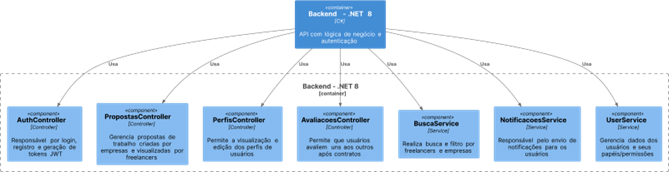
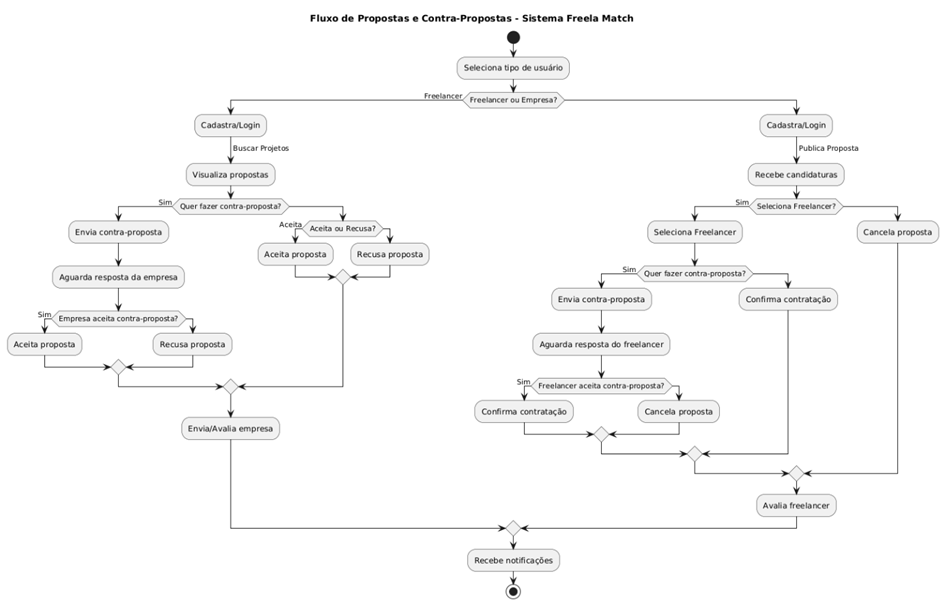

# CENTRO UNIVERSITÁRIO CATÓLICA DE SANTA CATARINA
## ENGENHARIA DE SOFTWARE
**ANNA BEATRIZ LOZ SILVA E SOUZA**

**FREELA MATCH**  
*Plataforma de Conexão entre Freelancers e Empresas*

**JOINVILLE – SC**  
**2025**

---

**ANNA BEATRIZ LOZ SILVA E SOUZA**

**FREELA MATCH**  
*Plataforma de Conexão entre Freelancers e Empresas*

**Trabalho de Conclusão de Curso**  
apresentado ao curso de Engenharia de Software do Centro Universitário Católica de Santa Catarina, como requisito parcial para obtenção do título de bacharel.  

**Orientador:** Diogo Vinícius Winck  

**JOINVILLE – SC**  
**2025**

---

## DEDICATÓRIA
Dedico este trabalho a todas as pessoas que estiveram ao meu lado nesta jornada. Aos que me inspiraram, me apoiaram e me deram forças para continuar. Essa conquista é de cada um de vocês também.

---

## AGRADECIMENTOS
A todos os professores do curso, pelo conhecimento compartilhado, dedicação e exemplo ao longo da minha formação acadêmica.  

Ao meu orientador, Professor Diogo Winck, pela orientação segura, apoio constante e valiosas contribuições que foram essenciais para a realização deste trabalho.  

Aos meus pais, pelo amor incondicional, pelos ensinamentos e por sempre acreditarem em mim.  

Às minhas irmãs, Isabella e Maria Rosa, por serem fonte constante de carinho e alegria.  

Ao Pedro Henrique, meu namorado e parceiro da vida, pelo apoio diário, pela paciência, companheirismo e amor inabalável.  

Aos meus amigos Sabine Freiman e Guilherme Tchornei, pela amizade verdadeira, pelas conversas, risadas e, especialmente, pela ajuda valiosa com este projeto.

---

## RESUMO
**Introdução:** O Freela Match é uma plataforma web, criada para facilitar a conexão entre freelancers e empresas.  
**Objetivo:** Oferecer um ambiente digital seguro, ágil e intuitivo para a contratação de serviços autônomos. A solução viabiliza o cadastro de perfis, a busca por oportunidades, o envio de propostas e a comunicação direta entre contratantes e profissionais, promovendo uma experiência completa e eficiente para ambas as partes.  
**Método:** Desenvolvida com foco em desempenho, escalabilidade e usabilidade, a aplicação reforça o compromisso com uma jornada digital de qualidade.  
**Conclusão:** Ao tornar o processo de intermediação mais transparente e funcional, o Freela Match se posiciona como uma ferramenta estratégica para a transformação digital do mercado de trabalho, respondendo às crescentes demandas por flexibilidade e inovação na contratação de talentos.  
**Palavras-chave:** Freela Match, conexão, freelancers

---

## SUMÁRIO

- [DEDICATÓRIA](#dedicatória)
- [AGRADECIMENTOS](#agradecimentos)
- [RESUMO](#resumo)
- [1. INTRODUÇÃO](#1-introdução)
  - [1.1 Contexto](#11-contexto)
  - [1.2 Justificativa](#12-justificativa)
  - [1.3 Objetivos](#13-objetivos)
- [2. DESCRIÇÃO DO PROJETO](#2-descrição-do-projeto)
  - [2.1 Tema do Projeto](#21-tema-do-projeto)
  - [2.2 Problemas a Resolver](#22-problemas-a-resolver)
  - [2.3 Limitações](#23-limitações)
- [3. ESPECIFICAÇÃO TÉCNICA](#3-especificação-técnica)
  - [3.1 Requisitos de Software](#31-requisitos-de-software)
  - [3.2 Considerações de Design](#32-considerações-de-design)
  - [3.3 Stack Tecnológica](#33-stack-tecnológica)
  - [3.4 Considerações de Segurança](#34-considerações-de-segurança)
- [4. PRÓXIMOS PASSOS](#4-próximos-passos)
  - [4.1 Implementação Inicial da Arquitetura](#41-implementação-inicial-da-arquitetura)
  - [4.2 Desenvolvimento dos Módulos Principais](#42-desenvolvimento-dos-módulos-principais)
  - [4.3 Testes Unitários e de Integração](#43-testes-unitários-e-de-integração)
  - [4.4 Implantação e Monitoramento](#44-implantação-e-monitoramento)
- [REFERÊNCIAS](#referências)
- [APÊNDICES](#apêndices)
- [AVALIAÇÕES DE PROFESSORES](#avaliações-de-professores)

---

## 1. INTRODUÇÃO

### 1.1 Contexto
Nas últimas décadas, o mercado de trabalho passou por transformações significativas impulsionadas pelo avanço da tecnologia e pela popularização do modelo remoto e autônomo de prestação de serviços. Esse cenário favoreceu o crescimento expressivo do número de freelancers, profissionais independentes que atuam em projetos temporários ou sob demanda, atendendo às necessidades específicas de empresas dos mais diversos setores. Paralelamente, organizações de pequeno, médio e grande porte têm recorrido cada vez mais a esse modelo como uma alternativa viável para suprir demandas pontuais, reduzir custos operacionais e obter maior flexibilidade nos processos de contratação.

Diante desse contexto, observa-se uma crescente demanda por plataformas digitais que atuem como pontes entre empresas e freelancers, permitindo o encontro entre oferta e demanda de forma eficiente, segura e transparente. No entanto, muitas das soluções disponíveis atualmente apresentam limitações em termos de usabilidade, confiabilidade ou personalização, dificultando o processo de intermediação e comprometendo a experiência dos usuários.

### 1.2 Justificativa
Este projeto se justifica pela necessidade de uma solução tecnológica que vá além das funcionalidades básicas de cadastro e busca, oferecendo um ambiente integrado que permita não apenas a conexão entre profissionais e contratantes, mas também o gerenciamento de propostas, negociações, comunicações e avaliações de desempenho. Ao priorizar aspectos como segurança, facilidade de uso e transparência, neste projeto busca-se fomentar relações profissionais mais confiáveis, eficientes e alinhadas às exigências do mercado atual.

Adicionalmente, este desenvolvimento representa uma oportunidade relevante de aplicação prática dos conhecimentos adquiridos ao longo da formação acadêmica, envolvendo o uso de tecnologias modernas e boas práticas de engenharia de software. O projeto visa ainda contribuir com o ecossistema de soluções digitais voltadas ao trabalho freelance, apresentando uma proposta inovadora e com potencial de escalabilidade.

### 1.3 Objetivos
**Objetivo Principal:** Desenvolver uma plataforma web que permita a conexão entre freelancers e empresas, facilitando a intermediação de serviços autônomos por meio de recursos que garantam segurança, usabilidade e eficiência.

**Objetivos Secundários:**
a) Implementar um sistema de autenticação seguro, com diferentes perfis de acesso (freelancer e empresa);  
b) Desenvolver mecanismos de busca e filtragem avançados para a localização de oportunidades e profissionais;  
c) Permitir o envio, recebimento e gerenciamento de propostas de trabalho dentro da própria plataforma;  
d) Integrar um sistema de avaliações e feedbacks para promover a confiança entre os usuários;  
e) Garantir uma experiência de usuário intuitiva, com foco em design responsivo e acessibilidade.

---

## 2. DESCRIÇÃO DO PROJETO

### 2.1 Tema do Projeto
Desenvolvimento de uma aplicação web voltada à mediação entre profissionais autônomos e empresas, com foco na otimização do processo de contratação de freelancers em um ambiente online funcional, seguro e acessível.

### 2.2 Problemas a Resolver
O Freela Match surge para solucionar desafios enfrentados tanto por freelancers quanto por empresas. De um lado, profissionais autônomos lidam com a dificuldade de acesso a oportunidades confiáveis e com a falta de critérios claros de avaliação. Do outro, empresas enfrentam obstáculos para encontrar talentos alinhados aos requisitos das vagas, devido à escassez de informações verificáveis e ferramentas eficazes de comparação e comunicação.

Para enfrentar essas questões, a plataforma contará com um sistema de "Match" inteligente, que conecta freelancers e vagas com base nas habilidades informadas nos perfis e nos requisitos das oportunidades. Além disso, incluirá perfis completos, histórico de desempenho e um sistema de feedback mútuo, promovendo mais segurança e confiança nas relações.

Com essas soluções, o Freela Match pode tornar o processo de contratação mais eficiente, confiável e alinhado às demandas do mercado, beneficiando tanto os profissionais quanto as empresas contratantes.

### 2.3 Limitações
Durante o desenvolvimento do projeto, foram estabelecidas algumas limitações para garantir o foco e a viabilidade técnica:  
a) A plataforma não realizará intermediação financeira; pagamentos ocorrerão diretamente entre usuários;  
b) Não haverá mecanismos formais para resolução de disputas entre freelancers e contratantes;  
c) O cadastro será restrito a empresas e profissionais autônomos, excluindo clientes pessoa física nesta etapa inicial.

Essas delimitações visam assegurar a implementação eficaz dentro dos prazos e recursos disponíveis.

---

## 3. ESPECIFICAÇÃO TÉCNICA

### 3.1 Requisitos de Software
#### Lista de Requisitos
**Requisitos Funcionais (RF):**  
1. **RF01** - O sistema permitirá a criação de contas com perfis distintos para freelancers e empresas, bem como o login para ambos os tipos de usuário.  
   - Freelancers poderão se cadastrar informando dados como nome, habilidades, portfólio, experiência e disponibilidade.  
   - Empresas poderão se cadastrar informando razão social, área de atuação, responsável pelo contato e dados da organização.  
2. **RF02** - Empresas poderão cadastrar propostas de trabalho.  
3. **RF03** - Freelancers poderão visualizar, aceitar ou recusar propostas.  
4. **RF04** - O sistema permitirá avaliações mútuas entre freelancers e empresas.  
5. **RF05** - Será possível realizar buscas e filtros avançados de perfis.  
6. **RF06** - O sistema permitirá a edição de perfis por freelancers e empresas.  
7. **RF07** - Empresas poderão visualizar o histórico de propostas enviadas e seu status.  
8. **RF08** - Freelancers poderão visualizar o histórico de propostas recebidas e seu status.  
9. **RF09** - O sistema enviará notificações para freelancers e empresas sobre novas propostas e atualizações.  
10. **RF10** - Administradores poderão gerenciar usuários e propostas indevidas.

**Requisitos Não Funcionais (RNF):**  
1. **RNF01** - O sistema suportará autenticação via JWT.  
2. **RNF02** - O tempo de resposta para as buscas será inferior a 2 segundos.  
3. **RNF03** - O banco de dados garantirá integridade referencial entre entidades.  
4. **RNF04** - O sistema será responsivo e acessível em dispositivos móveis e desktops.  
5. **RNF05** - O sistema de match automático entre perfis e vagas baseado em habilidades.

#### Representação dos Requisitos

---

### 3.2 Considerações de Design
#### Visão Inicial da Arquitetura
A aplicação será estruturada segundo o modelo cliente-servidor, com divisão clara entre as camadas de apresentação (front-end), lógica de negócios (back-end) e persistência de dados (banco de dados). Essa abordagem favorece a separação de responsabilidades, facilita a manutenção do sistema e permite escalabilidade futura.

#### Padrões de Arquitetura
- **Back-end:** Utilização do padrão MVC (Model-View-Controller) para organizar a lógica da aplicação de forma modular e reutilizável.  
- **Front-end:** Arquitetura baseada em SPA (Single Page Application), visando uma experiência fluida e responsiva ao usuário, sem recarregamento de páginas.

#### Modelos C4
1. **Contexto**  
   Representação do contexto do sistema.  
   

2. **Containers**  
   Representação dos subsistemas da aplicação.  
   

3. **Componentes**  
   Representação dos componentes e as respectivas interações no sistema.
   

---

### 3.3 Stack Tecnológica
#### Linguagens de Programação
- **Front-end:** TypeScript, utilizando o framework Angular 18.  
- **Back-end:** C#, por meio da plataforma .NET 8.  
- **Banco de Dados:** MySQL, para armazenamento estruturado e relacional.

#### Frameworks e Bibliotecas
- **Interface de Usuário (UI):** Angular Material e Bootstrap, visando um design moderno e responsivo.  
- **Persistência de Dados:** Entity Framework Core, atuando como ORM (Object-Relational Mapper).

#### Ferramentas de Desenvolvimento e Gestão de Projeto
- **Controle de Versão:** GitHub, para versionamento colaborativo do código-fonte.  
- **Integração e Entrega Contínua (CI/CD):** Azure DevOps, automatizando testes e deploys durante o ciclo de vida do projeto.

---

### 3.4 Considerações de Segurança
A segurança da informação é um aspecto central na arquitetura do Freela Match. Para mitigar riscos e proteger os dados dos usuários, serão adotadas as seguintes práticas:  
- Armazenamento seguro de senhas, com uso de técnicas de hashing e salting.  
- Controle de acesso baseado em autenticação via JWT e gerenciamento de permissões com Identity.  
- Validação de entradas para prevenir ataques de injeção de SQL e cross-site scripting (XSS).  

Essas medidas visam garantir a integridade, a confidencialidade e a disponibilidade das informações dentro do sistema.

---

## 4. PRÓXIMOS PASSOS
Com o levantamento de requisitos, definição da arquitetura e especificação das tecnologias a serem utilizadas, os próximos passos do projeto Freela Match seguem uma abordagem incremental, alinhada a boas práticas de engenharia de software. O processo de desenvolvimento será dividido em etapas sequenciais e interativas, conforme descrito a seguir:

### 4.1 Implementação Inicial da Arquitetura
**(Previsão: 18/07/2025 a 29/07/2025)**  
**Precedência:** Início do projeto  
- Configuração dos ambientes de desenvolvimento.  
- Integração das camadas de front-end, back-end e banco de dados.  
- Definição de rotas, entidades e modelos iniciais.  
- Implementação de autenticação básica.

### 4.2 Desenvolvimento dos Módulos Principais
**(Previsão: 30/07/2025 a 15/09/2025)**  
**Precedência:** Após 4.1  
- Cadastro e edição de perfis.  
- Criação e gerenciamento de propostas.  
- Sistema de busca com filtros.  
- Painel administrativo.  
- Mecanismo de avaliações mútuas.

### 4.3 Testes Unitários e de Integração
**(Previsão: 16/09/2025 a 26/09/2025)**  
**Precedência:** Após 4.2  
- Aplicação de práticas de TDD.  
- Testes de integração entre componentes críticos.  
- Validação contínua das funcionalidades implementadas.

### 4.4 Implantação e Monitoramento
**(Previsão: 29/09/2025 a 10/10/2025)**  
**Precedência:** Após 4.3  
- Publicação do sistema em ambiente de produção.  
- Configuração de ferramentas de monitoramento e logging.  
- Acompanhamento de desempenho e correção de falhas.

---

## REFERÊNCIAS
- MICROSOFT. Documentação oficial do .NET 8. Disponível em: <https://learn.microsoft.com/>.  
- ANGULAR. Angular 18 Documentation. Disponível em: <https://angular.io/docs>.  
- ROBERT C. MARTIN. *Clean Architecture: A Craftsman's Guide to Software Structure and Design*. Prentice Hall, 2017.  
- ERICH GAMMA et al. *Design Patterns: Elements of Reusable Object-Oriented Software*. Addison-Wesley, 1994.  
- FOWLER, Martin. *Patterns of Enterprise Application Architecture*. Addison-Wesley, 2002.

---

## APÊNDICES
O fluxograma a seguir foi incluído para ilustrar de forma visual e simplificada a lógica de funcionamento do sistema, facilitando o entendimento do processo descrito no desenvolvimento do trabalho.

---

## AVALIAÇÕES DE PROFESSORES
**Considerações Professor/a:** 